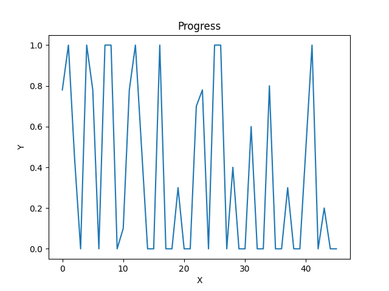

# Hongyi-Duan-Mini-Project-3

[](https://github.com/nogibjj/Hongyi-Duan-Mini-Project-1/actions/workflows/hello.yml)

This is the second course assignment of data engineering, which is about polars descriptive statistics script. There are four requirements of this assignment: Python script using polars for descriptive statistics, read a dataset (CSV or Excel), generate summary statistics (mean, median, standard deviation), create at least one data visualizatio. The dataset I chose is 'Project-Management-Sample-Data.xlsx'. The column I choose is "Progress", which ranges from 0 to 100%.

# Polars Statistical Analysis and Plotting

This repository contains Python scripts for performing basic statistical analysis using the Polars library and visualizing data using Matplotlib. The functionality includes calculating mean, median, standard deviation, and plotting data from a DataFrame. The project also includes unit tests to verify the accuracy of these functions.

## Table of Contents

- [Description](#description)
- [Visualizations](#visualizations)
- [Files](#files)
- [Requirements](#requirements)
- [How to Run](#how-to-run)
- [Testing](#testing)
- [License](#license)

## Description

This project provides Python functions for analyzing statistical properties (mean, median, standard deviation) of data stored in a Polars DataFrame. The analysis includes:

1. **Mean Calculation**: Computes the average of a column.
2. **Median Calculation**: Returns the middle value from a sorted list of values in a column.
3. **Standard Deviation Calculation**: Measures the spread of values in a column.
4. **Plotting Function**: Visualizes the data distribution in a column using Matplotlib.

The analysis is based on a sample dataset that includes a "Progress" column, which is plotted for visual representation.

## Visualizations

### Progress Plot

The figure below visualizes the "Progress" data:



This plot shows the variation in the "Progress" values, with peaks and troughs indicating fluctuations over time.

## Files

- **`main.py`**: Contains the main functions for statistical analysis (`get_mean`, `get_median`, `get_std`) and plotting (`get_plot`).
- **`test_main.py`**: Unit tests for the functions in `main.py`.
- **`Figure_Progress.png`**: The generated plot for the "Progress" column.
- **`Summary Report (Polars).pdf`**: A report summarizing the analysis and test results, including statistical description of the data and the output plot.

## Requirements

To run this project, ensure you have the following packages installed:

```bash
pip install polars matplotlib pytest
```

## How to Run

1. **Clone the repository**:

   ```bash
   git clone https://github.com/your-repo-url.git
   cd your-repo-url
   ```

2. **Run the analysis**:

   ```bash
   python main.py
   ```

   This will calculate the mean, median, standard deviation, and generate the plot for the dataset.

## Testing

To run the tests, execute:

```bash
python -m pytest test_main.py
```

The tests will check the correctness of the statistical functions using assertions and compare results against the Polars library's built-in methods. Refer to the **`Summary Report (Polars).pdf`** for detailed test results and the statistical description of the dataset.

## License

This project is licensed under the MIT License. See the [LICENSE](LICENSE) file for details.
